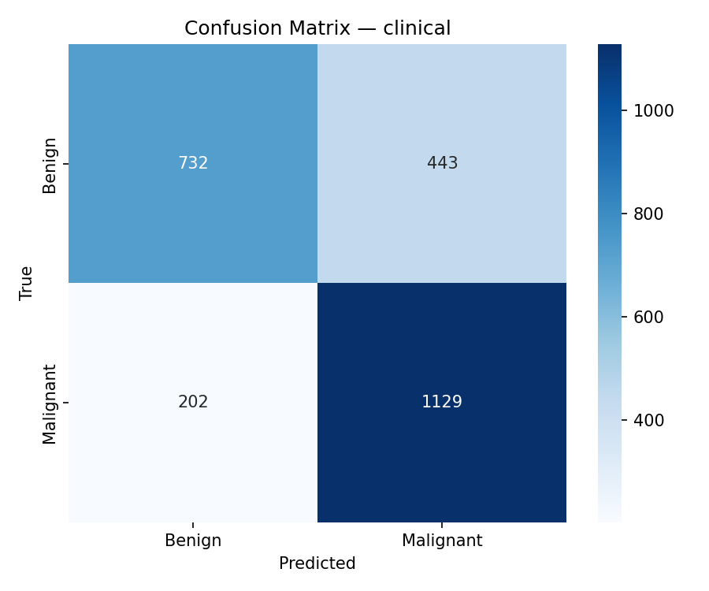
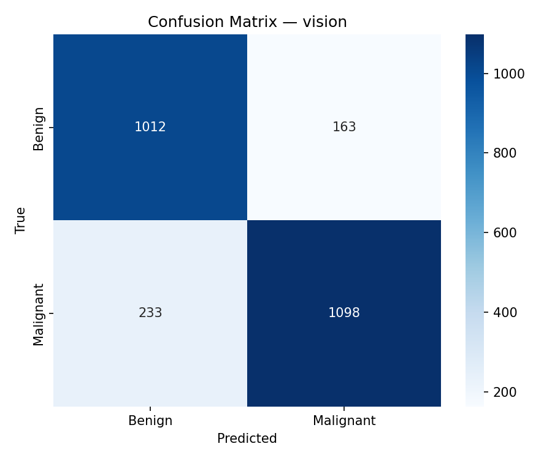
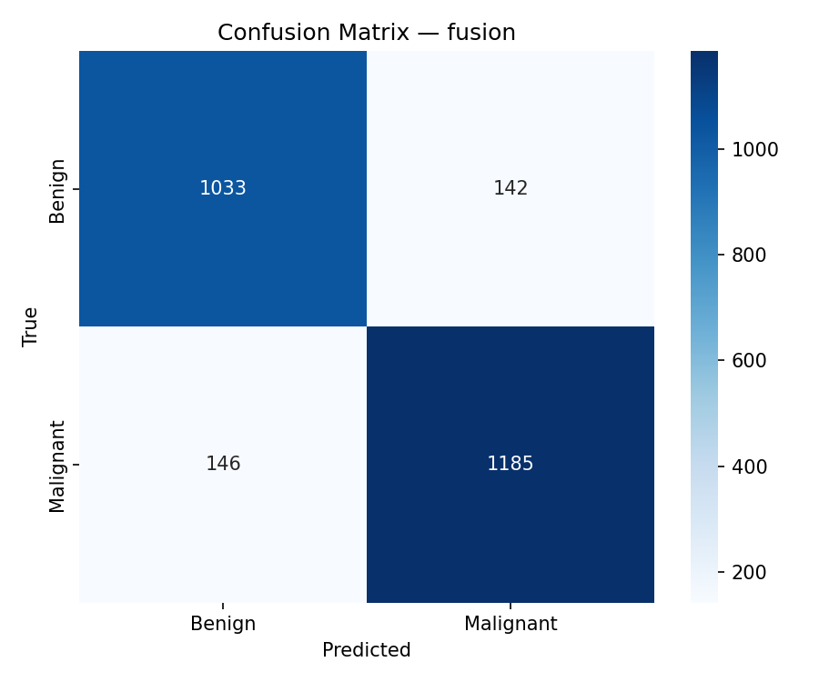

# Multi-Modal Skin Cancer Diagnosis

A dual-branch neural network that fuses **dermoscopic images** (ResNet-50 CNN) with **structured patient metadata** (MLP) to classify skin lesions as benign or malignant — outperforming either modality alone.

Trained and evaluated on the [BCN20000](https://doi.org/10.1038/s41597-024-03387-w) dataset (dermoscopic images collected at Hospital Clínic, Barcelona, 2010–2016).

## Motivation

Clinician diagnostic accuracy for melanoma varies widely (56–80%) depending on experience, and disagreement rates between specialists can reach 15–33%. CNNs trained on dermoscopic images (ResNet, EfficientNet, DenseNet) have become strong decision-support baselines, but most treat clinical metadata — age, sex, lesion site — as an afterthought, if they use it at all. This project builds a dedicated branch for that metadata and fuses it with image features through a learned fusion trunk, then measures exactly how much it helps and why.

## Architecture

```
Image  →  Vision Branch (ResNet-50, pretrained)     →  F_img (2048-d) ─┐
                                                                        ├→ Fusion Block → Classification Head → Benign / Malignant
Metadata →  Clinical Branch (4-layer MLP)            →  F_env (128-d)  ─┘
```

- **Vision branch:** ResNet-50 backbone pretrained on ImageNet, producing a 2048-dim embedding.
- **Clinical branch:** 4-layer MLP (128 → 256 → 128) with batch norm and dropout, producing a 128-dim embedding. Inputs are one-hot encoded categorical features (sex, lesion location, diagnosis confirm type, image type, melanocytic/biopsy flags) plus standardized age.
- **Fusion block:** concatenates both embeddings (2176-d) and projects down through two stages (2176 → 512 → 256) with BatchNorm, ReLU, and dropout.
- **Classification head:** single linear layer + softmax over benign/malignant, trained end-to-end with cross-entropy loss.
- **Two-phase training:** Phase 1 freezes the ResNet backbone and trains only the (randomly initialized) clinical branch and fusion block, so the untrained MLP doesn't destabilize a pretrained CNN. Phase 2 unfreezes the backbone for full end-to-end fine-tuning. The unfreeze epoch is itself a tuned hyperparameter (see below).

## Results

| Model | Accuracy | F1 (weighted) |
|---|---|---|
| Clinical-only | 74.3% | 0.739 |
| Vision-only | 84.2% | 0.842 |
| **Fusion** | **88.5%** | **0.885** |

Hyperparameters (dropout, learning rate, weight decay, backbone-unfreeze epoch) were tuned separately per model via Bayesian search in Ray Tune.

For context, human dermatologists typically fall in the 56–80% accuracy range on this task.

### Confusion matrices

| Clinical-only | Vision-only | Fusion |
|---|---|---|
|  |  |  |

### Modality contribution analysis

Using a feature-zeroing ablation (zeroing one branch's embedding at inference and comparing logits to the full fusion model), the vision branch accounts for roughly two-thirds of the fusion model's predictions on average, with clinical metadata contributing disproportionately more to suppressing false positives on benign cases that visually mimic malignancies. Misclassified examples cluster where neither modality dominates (vision contribution roughly 20–80%), suggesting most errors happen on genuinely ambiguous cases rather than a systematic weakness in either branch.

## Setup

**1. Clone and install dependencies**
```bash
git clone <repo-url>
cd <repo-name>
python -m venv .venv
source .venv/bin/activate        # Windows: .venv\Scripts\activate
pip install -r requirements.txt
```

> **GPU users:** install PyTorch with the correct CUDA build first — see the comment at the top of `requirements.txt` or visit https://pytorch.org/get-started/locally/

**2. Download the dataset**

Download BCN20000 (or your preferred ISIC-derived dermoscopic dataset with matching metadata) and place files as:

```
data/
├── dataset.csv        # clinical metadata + labels
└── images/             # dermoscopic images
```

**3. Configure**

Edit [`config.py`](config.py) to match your dataset:
- `CLINICAL_FEATURES` — column names of the clinical metadata features in your CSV
- `CLASS_NAMES` — `["benign", "malignant"]` (or your label ordering)
- `CNN_BACKBONE` — `"resnet50"`

## Usage

**Train (full fusion model)**
```bash
python train.py
```

**Train a single branch (for ablation)**
```bash
python train.py --mode vision      # CNN only
python train.py --mode clinical    # MLP only
```

**Evaluate + ablation study**
```bash
python evaluate.py                 # all three modes side-by-side
python evaluate.py --mode fusion
```

Confusion matrices and the ablation CSV are saved to `evaluation_results/`.

**Verify data pipeline**
```bash
python dataset.py
```

**Verify model architecture**
```bash
python models/fusion_model.py
```

## Project Structure

```
├── config.py                    # hyperparameters and feature definitions
├── dataset.py                   # data loading, augmentation, preprocessing
├── models/
│   ├── vision_branch.py         # ResNet-50 feature extractor
│   ├── clinical_branch.py       # MLP feature extractor
│   └── fusion_model.py          # fusion architecture
├── train.py                     # two-phase training loop
├── evaluate.py                  # metrics, confusion matrices, ablation study
├── data/                        # dataset goes here (not committed)
└── checkpoints/                 # saved model weights (not committed)
```

## Limitations & Future Work

- **Class imbalance / augmentation:** the current pipeline doesn't augment rare lesion presentations; targeted augmentation of edge cases (atypical pigmentation, unusual anatomical sites) is a planned improvement.
- **Static fusion:** the fusion block uses concatenation + linear projection. Attention-based (cross-attention) fusion could let the model weight modalities per-case rather than statically.
- **Loss function:** cross-entropy treats false negatives and false positives equally; a risk-weighted loss (e.g., focal loss) would better reflect the clinical cost of missing a malignant case.
- **Backbone:** ResNet-50 could be swapped for a Vision Transformer to better capture long-range spatial dependencies in lesion images.
- **Longitudinal data:** the model only sees single snapshots; tracking lesion evolution over time would more closely mirror how dermatologists actually assess risk.

## References

- Haggenmüller, S. et al. (2025). Discordance, accuracy and reproducibility study of pathologists' diagnosis of melanoma and melanocytic tumors. *Nature Communications*, 16(1), 789.
- Hernández-Pérez, C. et al. (2024). BCN20000: Dermoscopic lesions in the wild. *Scientific Data*, 11(1), 641.
- Morton, C.A. & Mackie, R.M. (1998). Clinical accuracy of the diagnosis of cutaneous malignant melanoma. *British Journal of Dermatology*, 138(2), 283–7.
